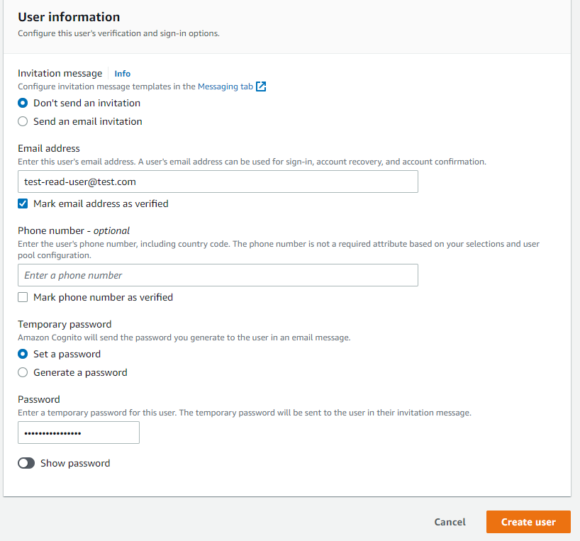

# Fine-grained access control for API Gateway using Lambda Authorizer

## <!--BEGIN STABILITY BANNER-->


> **This is a stable example. It should successfully build out of the box**
>
> This examples is built on Construct Libraries marked "Stable" and does not have any infrastructure
> prerequisites to build.

---

<!--END STABILITY BANNER-->

This C# CDK pattern creates Amazon Cognito user pool, Amazon API Gateway, AWS Lambda auth function, Amazon DynamoDB table, and AWS Lambda backend function. Auth Lambda function verify JWT token received in request header returns access policy associated with token user group. Based on access policy, API GW decides to forward the request to backend Lambda function or return 401/403 http status.


Important: this application uses various AWS services and there are costs associated with these services after the Free Tier usage - please see the [AWS Pricing page](https://aws.amazon.com/pricing/) for details. You are responsible for any AWS costs incurred.

## Requirements

- [Create an AWS account](https://portal.aws.amazon.com/gp/aws/developer/registration/index.html) if you do not already have one and log in. The IAM user that you use must have sufficient permissions to make necessary AWS service calls and manage AWS resources.
- [AWS CLI](https://docs.aws.amazon.com/cli/latest/userguide/install-cliv2.html) installed and configured
- [AWS CDK](https://docs.aws.amazon.com/cdk/v2/guide/cli.html) installed and configured
- [Git Installed](https://git-scm.com/book/en/v2/Getting-Started-Installing-Git)
- [.Net 6.0 SDK](https://dotnet.microsoft.com/en-us/download/visual-studio-sdks) installed

## Deployment Instructions

1. Create a new directory, navigate to that directory in a terminal and clone the GitHub repository:
   ```
   git clone https://github.com/aws-samples/aws-cdk-examples.git
   ```
2. Change directory to the pattern directory:
   ```
   cd csharp\apigateway-cognito-lambda-dynamodb
   ```
3. Build the application:
   ```
   dotnet build
   ```
4. Run Dotnet Publish command for backend Lambda function:

   ```
   dotnet publish Lambda\BackendFunction\BackendFunction.csproj -c Release -o dist/BackendFunction
   ```

5. Run Dotnet Publish command for auth Lambda function:
   ```
   dotnet publish Lambda\AuthFunction\AuthFunction.csproj -c Release -o dist/AuthFunction
   ```
6. From the command line, use AWS CDK to deploy the AWS resources for the pattern as specified in CdkStack.cs file:
   ```
   cdk deploy ApiGatewayAuthStack
   ```
7. Note down CognitoHostedUIUrl, and APIGWEndpoint from CloudFormation output. This will be used for testing

8. Populate data in DynamoDB table:

   Run following AWS CLI command at 'apigateway-cognito-lambda-dynamodb' directory level

   ```
   aws dynamodb batch-write-item --request-items file://DynamoDBData.json
   ```

## How it works

User need to pass JWT token in API GW request header. User can get the JWT token by using Cognito hosted UI (CDK code creates Cognito user pool and enable hosted UI). If token not present in request header then API GW returns 401 Unauthorized response. If token present in the request header then it gets pass to Auth Lambda function.

At Auth Lambda function, token signture gets verified by using JWKs provided by Cognito User pool. Auth Lambda function calls Cognito key url to get the JWKs.

Once token signature gets verified and confirmed token has not expired, code verifies token claims and fetch user group associated with the token. Based on user group, Auth Lambda function pulls API GW access policy document from DynamoDB table. If user group not present in DynamoDB table then function returns deny policy and based on this deny policy API GW will return 403 Forbidden response to user. If user group present in DynamoDB table then associated API GW access policy document will get return to API GW.

Based on return policy by Auth Lambda function, APi GW decides either to forward the request to backend Lambda or return 403 Forbidden response. If JWT token is invalid, in terms of JWT structure or signature, Auth Lambda function raise "Unauthorized" exception which in turns into 401 Unauthorized response back to user.

## Testing

1. Login to AWS console and navigate to Cognito service

2. Select User pool - "CognitoUserPool" and create an user. Remember user email id and password, need it use for testing
   

3. Add newly created user to user group - "read-only"
   

4. Create one more user and add it to user group - "read-update-add". Remember user email id and password, need it use for testing

5. Access Cognito app client hosted UI. You can find Hosted UI url in CloudFormation output

6. Login to Hosted UI with first user which is assigned to "read-only" user group. Cognito Hosted UI may ask to enter new password if its first login attempt, please set new password if asked. After succesful login, UI will navigate user to localhost URL with access_token in the url

7. Get the access_token (not id_token) from the localhost url

8. Use Postman or curl command to invoke the API GW GET endpoint. Pass access_token as "Authorization" in request header. Make sure "Bearer " present at start of the token. You can get the API GW endpoint URL in CloudFormation output
   

9. Confirm API GW returned 200 Success response

10. Now invoke POST endpoint with access_token of first user which is assigned to "read-only" user group.

11. Confirm API GW retuned 403 Forbidden response

12. Login to Hosted UI with second user which is assigned to "read-update-add" user group and get the access_token (not id_token). Cognito Hosted UI may ask to enter new password if its first login attempt, please set new password if asked.

13. Invoke GET endpoint with access token of second user

14. Confirm API GW returned 200 Success response

15. Invoke POST endpoint with access token of second user

16. Confirm API GW returned 200 Success response

17. Invoke GET or POST endpoint with invalid token

18. Confirm API GW returned 401 Unauthorized response

## Cleanup

Run the following commands at eventbridge-firehose-s3-cdk folder level

1. Delete the stack
   ```bash
   cdk destroy ApiGatewayAuthStack
   ```
1. Confirm the stack has been deleted
   ```bash
   aws cloudformation list-stacks --query "StackSummaries[?contains(StackName,'ApiGatewayAuthStack')].StackStatus"
   ```

## Related resources

[Verifying a JSON web token](https://docs.aws.amazon.com/cognito/latest/developerguide/amazon-cognito-user-pools-using-tokens-verifying-a-jwt.html)

[API GW Resource Policies](https://docs.aws.amazon.com/apigateway/latest/developerguide/apigateway-resource-policies.html)

[Control access for invoking an API](https://docs.aws.amazon.com/apigateway/latest/developerguide/api-gateway-control-access-using-iam-policies-to-invoke-api.html)

[API GW Policy statement resource expression format](https://docs.aws.amazon.com/apigateway/latest/developerguide/api-gateway-control-access-using-iam-policies-to-invoke-api.html#api-gateway-iam-policy-resource-format-for-executing-api)

[Lambda authorizer request format](https://docs.aws.amazon.com/apigateway/latest/developerguide/api-gateway-lambda-authorizer-input.html)

[Lambda authorizer response format](https://docs.aws.amazon.com/apigateway/latest/developerguide/api-gateway-lambda-authorizer-output.html)

[Amazon Cognito hosted UI](https://docs.aws.amazon.com/cognito/latest/developerguide/cognito-user-pools-app-integration.html)

[API Gateway Lambda authorizers](https://docs.aws.amazon.com/apigateway/latest/developerguide/apigateway-use-lambda-authorizer.html)
