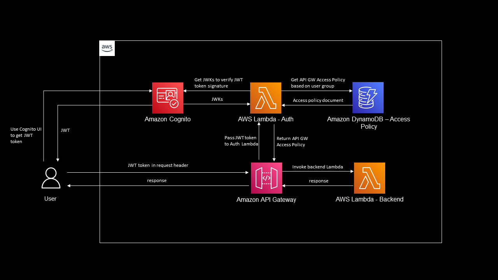

# Amazon Cognito to Amazon API Gateway to Amazon Lambda to DynamoDB using .Net CDK

## <!--BEGIN STABILITY BANNER-->


> **This is a stable example. It should successfully build out of the box**
>
> This examples is built on Construct Libraries marked "Stable" and does not have any infrastructure
> prerequisites to build.

---

<!--END STABILITY BANNER-->

This pattern creates Amazon Cognito user pool, Amazon API Gateway, AWS Lambda auth function, Amazon DynamoDB table, and AWS Lambda backend function. JWT token from API GW request header gets verified by Auth Lambda function and Auth Lambda function returns access policy associated with token user group. Based on access policy, API GW decides to pass request to backend Lambda function or return 401/403 accordingly.



Important: this application uses various AWS services and there are costs associated with these services after the Free Tier usage - please see the [AWS Pricing page](https://aws.amazon.com/pricing/) for details. You are responsible for any AWS costs incurred.

## Requirements

- [Create an AWS account](https://portal.aws.amazon.com/gp/aws/developer/registration/index.html) if you do not already have one and log in. The IAM user that you use must have sufficient permissions to make necessary AWS service calls and manage AWS resources.
- [AWS CLI](https://docs.aws.amazon.com/cli/latest/userguide/install-cliv2.html) installed and configured
- [AWS CDK](https://docs.aws.amazon.com/cdk/v2/guide/cli.html) installed and configured
- [Git Installed](https://git-scm.com/book/en/v2/Getting-Started-Installing-Git)
- [.Net 6.0 SDK](https://dotnet.microsoft.com/en-us/download/visual-studio-sdks) installed

## Deployment Instructions

1. Create a new directory, navigate to that directory in a terminal and clone the GitHub repository:
   ```
   git clone https://github.com/aws-samples/aws-cdk-examples.git
   ```
2. Change directory to the pattern directory:
   ```
   cd csharp\apigateway-cognito-lambda-dynamodb
   ```
3. Build the application:
   ```
   dotnet build
   ```
4. From the command line, use AWS CDK to deploy the AWS resources for the pattern as specified in CdkStack.cs file:
   ```
   cdk deploy ApiGatewayAuthStack
   ```
5. Populate data in DynamoDB table:

   Run following AWS CLI command at 'apigateway-cognito-lambda-dynamodb' directory level

   ```
   aws dynamodb batch-write-item --request-items file://DynamoDBData.json
   ```

## How it works

User need to pass bearer token in API GW request header. User can get the JWT token by using Cognito hosted UI (CDK code creates Cognito user pool and enable hosted UI). If token not present in request header then API GW returns 401 Unauthorized response. If token present then it gets pass to Auth Lambda function. At Auth Lambda function, token signture gets verified by using JWKs provided by Cognito User pool. Auth Lambda function calls Cognito ruser url to get the JWKs. Once token signature gets verified and confirmed token has not expired, code verifies token claims and fetch user group associated with token. Based on user group, Auth Lambda function pulls API GW access policy document from DynamoDB table. If user group not present in DynamoDB table then function returns deny policy and based on this deny policy API GW will return 403 Forbidden response to user. If user group present in DynamoDB table then associated API GW access policy document will return to API GW. Based on return policy by Auth Lambda function, APi GW decides either to pass request to backend Lambda or return 403 Forbidden response. If JWT token is invalid, in terms of JWT structure or signature, Auth Lambda function raise "Unauthorized" exception which in turns into 401 Unauthorized response back to user.

## Testing

1. Send message to EventBridge by using command at eventbridge-firehose-s3-cdk folder level -

   ```
   aws events put-events --entries file://SampleEvent.json
   ```

2. Navigate to S3 bucket created by CDK and confirm message has saved at path {department}/{event message file}
3. Please note: Firehose delivery stream buffer is configured for 60secs (default time), so please wait for 1-2 mins after event send command to get the message in S3 bucket

## Cleanup

Run the following commands at eventbridge-firehose-s3-cdk folder level

1. Delete the stack
   ```bash
   cdk destroy EventBridgeFirehoseS3Stack
   ```
1. Confirm the stack has been deleted
   ```bash
   aws cloudformation list-stacks --query "StackSummaries[?contains(StackName,'EventBridgeFirehoseS3Stack')].StackStatus"
   ```

at aws-cdk-examples\csharp\apigateway-cognito-lambda-dynamodb -
dotnet publish Lambda\BackendFunction\BackendFunction.csproj -c Release -o dist/BackendFunction
dotnet publish Lambda\AuthFunction\AuthFunction.csproj -c Release -o dist/AuthFunction

https://docs.aws.amazon.com/cognito/latest/developerguide/amazon-cognito-user-pools-using-tokens-verifying-a-jwt.html
API GW Access Policy-
https://docs.aws.amazon.com/apigateway/latest/developerguide/apigateway-resource-policies.html
Policy statement resource url
https://docs.aws.amazon.com/apigateway/latest/developerguide/api-gateway-control-access-using-iam-policies-to-invoke-api.html#api-gateway-iam-policy-resource-format-for-executing-api
https://docs.aws.amazon.com/apigateway/latest/developerguide/api-gateway-lambda-authorizer-input.html
https://docs.aws.amazon.com/apigateway/latest/developerguide/api-gateway-lambda-authorizer-output.html

aws dynamodb batch-write-item --request-items file://DynamoDBData.json
